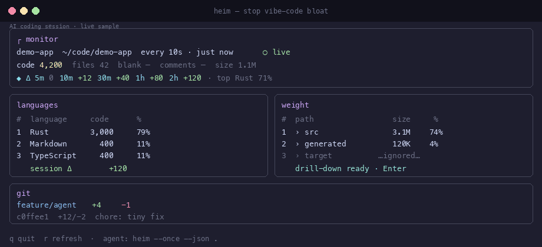

# heim

**Stop vibe-code bloat: real-time LOC/size/git deltas + JSON agents can self-audit.**

Live control surface for AI coding sessions — languages, disk weight, git, and time-window deltas in a compact TUI, plus machine-readable stats your agent can query.

[](https://github.com/aiatsuk/heim/actions/workflows/ci.yml)
[](LICENSE)
[](https://crates.io/crates/heim-monitor)

> **Name note:** Unrelated to the older [heim](https://crates.io/crates/heim) system-information crate.  
> **crates.io package:** [`heim-monitor`](https://crates.io/crates/heim-monitor) · **binary:** `heim`

<p align="center">
  
</p>

<sub>
Story: quiet project → agent scaffolds → Δ / 2h spikes → <code>ALERT</code> → <code>heim --once --json</code> self-audit → cleanup.  
Regenerate: <code>python3 scripts/gen_demo_gif.py</code> · live capture: <a href="docs/demo.tape">docs/demo.tape</a> (VHS).
</sub>

---

## Motivation

### The problem: AI writes a lot of code, fast

Coding agents and LLMs changed the bottleneck. You no longer wait on typing speed — you wait on **judgment**:

- A single session can add **thousands of lines** in minutes (scaffolds, “just in case” modules, duplicated helpers, verbose comments, dead experiments).
- The tree **grows quietly**: new folders, fat assets, generated junk next to real product code.
- Git history fills with large commits that are hard to review after the fact.
- Classic tools (`tokei`, `cloc`, `du`, `git log`) answer one-off questions. They do **not** sit beside the agent and show *how much landed in the last 5 minutes / 2 hours*.
- Without a live control surface, “vibe-coded” repos tend toward **bloat**: hard to navigate, expensive to review, and full of code nobody asked to keep.

The failure mode is not “AI can’t code.” It’s **unbounded volume without feedback**.

### The solution: heim

**heim** is a small local dashboard purpose-built for that loop.

| You need | heim gives you |
|----------|----------------|
| See generation as it happens | Live TUI: languages, size, git, refresh on a timer |
| Notice “too much code” early | Δ windows (5m → 1d): *how many lines appeared recently* |
| Tell the agent to clean up **with numbers** | `heim --once --json` and `.heim/stats.json` — same metrics, machine-readable |
| Know *where* weight and LOC went | Ranked languages + disk weight with drill-down |
| Stay in control of the session | You watch; the agent can re-query stats and trim |

In short: **heim turns “the model wrote a lot” from a gut feeling into measurable, actionable stats** — for humans in the terminal and for agents that can shell out and self-audit.

### Typical loop

1. Start `heim` in the project (or sample with `--once` while you work).
2. Let the agent implement features.
3. Glance at Δ (or ask the agent): *“How many lines in the last 2 hours? Too much — remove noise.”*
4. Agent runs `heim --once --json .`, reads `deltas` / top paths / git, cleans up, re-checks.

```bash
# human: live control surface
heim -i 10

# agent: self-check
heim --once --json .
# or: cat .heim/stats.json
```

---

## Features

- **Languages** — in-process LOC (tokei): totals and per-language ranking (code, blank, comments, %)
- **Weight** — top paths by size; directory drill-down; fast parallel walk (optional `dust`)
- **Git** — branch, dirty +/-, recent commits, activity strip
- **Deltas** — wall-clock windows **5m / 10m / 30m / 1h / 2h** in the TUI; JSON also includes **4h / 8h / 1d**
- **JSON for agents** — `heim --once --json` (+ optional `-o file`) and auto-updated `.heim/stats.json`
- **Hints / soft alerts** — JSON `hints[]` flags high 30m / 2h volume (`ALERT:` lines)
- **Private store** — `.heim/` history for cross-session windows
- **Headless text** — `heim --once` human-readable sample
- **Single binary** — no daemon, no network, **no required external LOC tool**

---

## Requirements

| Dependency | Required? | Role |
|------------|-----------|------|
| [Rust](https://rustup.rs/) **1.74+** | to build / install from source | MSRV |
| [`git`](https://git-scm.com/) | recommended | git panel / commits |
| [`dust`](https://github.com/bootandy/dust) | optional | alternate size backend (`--size-backend dust`) |

LOC counting is **built in** (via [tokei](https://github.com/XAMPPRocky/tokei)). No `cloc` install needed.

```bash
# optional faster/alternate disk backend
brew install dust          # macOS
cargo install du-dust      # binary name: dust
```

---

## Install

### Prebuilt binaries (GitHub Releases)

When a version is tagged (`v0.1.0`, …), downloads appear at  
https://github.com/aiatsuk/heim/releases

```bash
# one-liner (macOS / Linux) — needs a published release
curl -fsSL https://raw.githubusercontent.com/aiatsuk/heim/main/scripts/install.sh | bash

# manual example (Apple Silicon) — adjust version/target
curl -sL "https://github.com/aiatsuk/heim/releases/download/v0.1.0/heim-0.1.0-aarch64-apple-darwin.tar.gz" \
  | tar -xz
sudo mv heim /usr/local/bin/
```

### cargo / crates.io

```bash
# package name is heim-monitor; installs the `heim` binary
cargo install heim-monitor --locked
```

### From git / clone

```bash
cargo install --git https://github.com/aiatsuk/heim --locked

# or
git clone https://github.com/aiatsuk/heim.git
cd heim && cargo install --path . --locked
```

### cargo-binstall

```bash
cargo binstall heim-monitor
```

### Homebrew (tap formula template)

A formula sketch lives in [`dist/homebrew/heim.rb`](dist/homebrew/heim.rb) for use in a personal tap once release checksums are filled in.

---

## Quick start

```bash
# 1) Watch an AI coding session live
heim                 # current directory, refresh every 60s
heim -i 10           # faster refresh while the agent works

# 2) Agent / script: full stats as JSON
heim --once --json .
heim --once --json -o /tmp/heim-stats.json .

# 3) Agent reads the auto snapshot (updated on every sample)
cat .heim/stats.json
```

---

## CLI

```text
heim [OPTIONS] [PATH]

Arguments:
  [PATH]   Project directory [default: cwd]

Options:
  -i, --interval <SECS>         TUI refresh interval [default: 60]
      --size-backend <BACKEND>  auto | dust | walk [default: auto]
      --once                    One sample, no TUI (human text unless --json)
      --json                    Machine-readable JSON report (implies one-shot)
  -o, --output <FILE>           Write JSON to FILE (implies --json); use - for stdout only
  -h, --help
  -V, --version
```

`auto` size backend uses the in-process parallel walk (usually much faster than shelling out to `dust`). Use `--size-backend dust` if you want dust’s hardlink accounting.

### JSON report (`heim.stats.v1`)

```bash
heim --once --json . | jq '{
  code: .loc.code,
  d2h: (.deltas[] | select(.window=="2h")),
  alerts: [.hints[] | select(startswith("ALERT:"))]
}'
```

Includes:

| Field | Meaning |
|-------|---------|
| `loc` | code / files / blank / comment + per-language breakdown |
| `size` | bytes, human size, engine, top directories |
| `git` | branch, dirty +/-, recent commits |
| `deltas[]` | per window: `ready`, `code`, `size_bytes`, git `insertions` / `deletions` (5m…1d) |
| `session` | deltas since this process baseline |
| `history` | sample count, span, store path |
| `hints` | short guidance for agents / humans (may include `ALERT:`) |

Every sample (TUI or `--once`) also refreshes:

```text
<project>/.heim/stats.json
```

so an agent can either **shell out** to `heim --once --json` or **read the file**.

### Example agent prompt

> Run `heim --once --json .` in the project root. Look at `deltas` for `"30m"` and `"2h"`.
> If `code` is large (or any `hints` line starts with `ALERT:`), list the heaviest paths
> under `size.top` and recent `git.recent_commits`, then remove dead generated code and re-check.

Full contract + skill: **[docs/for-agents.md](docs/for-agents.md)** · **[skills/heim-audit](skills/heim-audit/SKILL.md)**

---

## Interface (TUI)

### Layout

| Panel | Contents |
|-------|----------|
| **monitor** | Path · interval · age · live state · LOC totals · size · Δ code 5m–2h |
| **languages** | Ranked languages + session Δ |
| **weight** | Ranked paths + drill-down |
| **git** | Branch · dirty +/- · commits · activity (collapses when empty) |
| **footer** | Key hints |

### Keyboard

| Key | Action |
|-----|--------|
| `q` / `Ctrl-C` | Quit |
| `r` | Force refresh |
| `+` / `-` | Interval ±1s (1–300) |
| `Tab` / `Shift-Tab` | Focus next / prev panel |
| `j` `k` / arrows | Move selection |
| `Enter` / `l` | Open weight directory |
| `Backspace` / `h` | Weight parent |
| `?` | Help |

### Mouse

Click to focus/select, wheel to scroll, drag the vertical rail or git top edge to resize, double-click to open a weight dir, right-click to go up.

---

## Smart ignores

Skips common heavy dirs for size + LOC, including:  
`.git`, `node_modules`, `target`, `dist`, `build`, `.venv`, `__pycache__`, `.next`, `vendor`, `.heim`, `.dart_tool`, `.build`, and similar monorepo dumps.

LOC also respects `.gitignore` (tokei).

---

## Private store (`.heim/`)

```text
.heim/
  .gitignore
  README
  sessions.jsonl   # session start/end
  samples.jsonl    # history for Δ windows (~48h retain)
  stats.json       # latest full report for agents
```

Local only — do not commit. heim does not send data over the network.

---

## How it works

1. Background worker counts LOC in-process (tokei), measures size (walk or `dust`), and samples `git` in parallel.
2. UI thread stays smooth (~120 Hz animations); collectors never block paint.
3. Samples append to `.heim/samples.jsonl` and rewrite `.heim/stats.json`.
4. Time windows use wall-clock history (this session + store), so “last 2 hours” works across restarts.

---

## Platforms

| Platform | Status |
|----------|--------|
| **macOS** | Primary |
| **Linux** | CI-tested |
| **Windows** | Experimental (CI allowed to fail) |

UTF-8 terminal recommended.

---

## Troubleshooting

| Symptom | Fix |
|---------|-----|
| Empty languages | No countable source under ignores / `.gitignore` |
| Slow huge monorepos | Check ignores; try `--size-backend walk` (default) |
| Git panel empty | Not a repo / no `git` — rest still works |
| `deltas[].ready == false` | Not enough history yet — keep sampling |
| Agent sees stale numbers | Re-run `heim --once --json .` |
| `cargo install heim` fails | Use **`cargo install heim-monitor`** (name clash on crates.io) |

---

## Development

```bash
cargo fmt --check
cargo clippy --all-targets -- -D warnings
cargo test
cargo build --release
./target/release/heim --once --json . | head
```

```text
src/
  main.rs     CLI, event loop, worker
  app.rs      state, deltas, focus
  collect.rs  LOC / size / git
  report.rs   JSON report for agents
  store.rs    .heim persistence
  ui.rs       ratatui
  theme.rs    colors / glyphs
  fmt.rs      formatting helpers
```

### Docs for launch & agents

| Doc | Purpose |
|-----|---------|
| [docs/for-agents.md](docs/for-agents.md) | JSON contract `heim.stats.v1` + agent prompt |
| [skills/heim-audit](skills/heim-audit/SKILL.md) | Drop-in agent skill |
| [docs/skill-packaging.md](docs/skill-packaging.md) | Wire skill into Claude/Cursor/Codex |
| [docs/launch-post.md](docs/launch-post.md) | Show HN / Reddit / X drafts |
| [docs/soft-feedback.md](docs/soft-feedback.md) | Pre-launch 5-user outreach |
| [docs/PUBLISH.md](docs/PUBLISH.md) | Tag, crates.io, Homebrew checklist |

See [CONTRIBUTING.md](CONTRIBUTING.md) and [CHANGELOG.md](CHANGELOG.md).

---

## Related tools

| Tool | Focus |
|------|--------|
| [`tokei`](https://github.com/XAMPPRocky/tokei) / [`cloc`](https://github.com/AlDanial/cloc) | One-shot LOC |
| [`dust`](https://github.com/bootandy/dust) | Disk usage |
| `git` / lazygit | Full VCS workflows |
| **heim** | **Live + agent-readable project growth control** |

---

## Security

Local tool: reads the project, shells out to `git` / optional `dust`, writes under `.heim/`. See [SECURITY.md](SECURITY.md).

---

## License

[MIT](LICENSE) © 2026 aiatsuk
